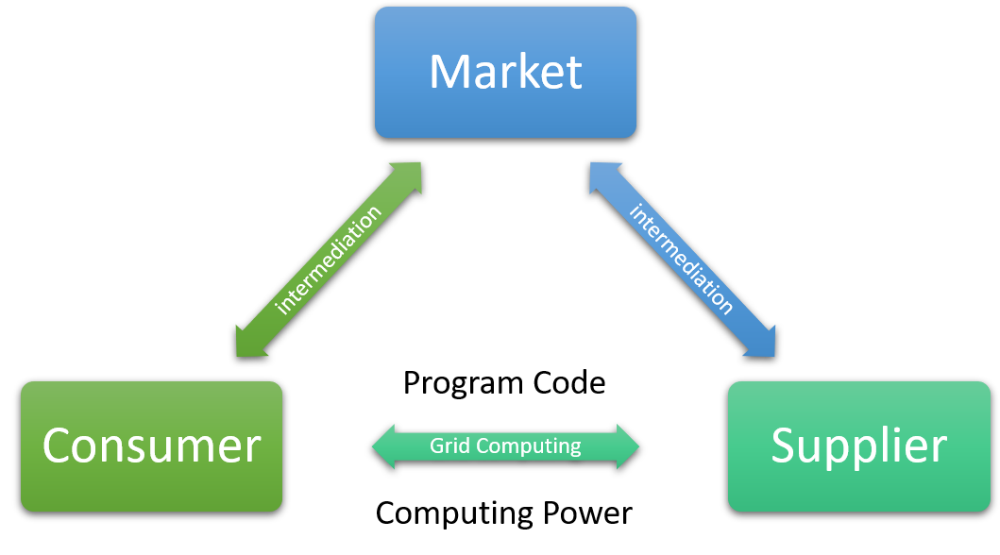

# TGrid 기능 테스트
## 1. SW 기본정보 (팀명: TGrid)
### 1.1. SW 명
  - TGrid

### 1.2. SW 개요


TGrid: **T**ypescript **Grid** computing framework.

**TGrid** 는 그 이름 그대로, TypeScript에서 [Grid Computing](https://tgrid.com/ko/tutorial/concepts.html#11-grid-computing) 시스템을 구현하는 데 유용하게 사용할 수 있는 Framework 입니다. **TGrid** 와 그것의 핵심 개념인 [Remote Function Call](https://tgrid.com/ko/tutorial/concepts.html#12-remote-function-call) 을 사용하면, 여러 대의 컴퓨터를 단 한 대의 가상 컴퓨터로 만들 수 있습니다.

자세한 내용은 가이드 문서를 참고해주세요.

  - 가이드 문서: https://tgrid.com

### 1.3. Test 환경정보
테스트 환경은 OS 나 플랫폼 여부에 상관없이, 그저 [NodeJS](https://nodejs.org) 만 설치할 수 있으면 됩니다. 덤으로 원활한 소스코드 다운로드를 위하여, `Git` 이 설치되어있으면 더욱 좋습니다. 만일 윈도우에 NodeJS 를 설치하는 경우시라면, 반드시 C++ 컴파일러 (`node-gyp`) 를 함께 설치해주세요.

```bash
sudo apt-get install git
sudo apt-get install nodejs
sudo apt-get install npm

sudo npm install -g typescript

git clone https://github.com/samchon/tgrid
git clone https://github.com/samchon/tstl
```


## 2. SW 기능 리스트
기능 항목 리스트는 별도 엑셀 파일로 분리하였습니다.

  - 첨부파일: [test-sheets.xlsx](test-sheets.xlsx)

### 2.1. TGrid
메인 프로젝트인 **TGrid** 입니다. **TGrid** 는 어플리케이션이 아닌 프레임워크의 범주에 들기 때문에, 기능 테스트라기보다는 모듈 및 컴포넌트 테스트에 가까울 것입니다. 따라서 첨부된 엑셀 파일의 **3.1. TGrid** 시트에 적힌 항목들도 모두, API 스펙에 가깝도록 작성되었습니다.

  - API 문서: https://tgrid.com/api
  - 소스 코드: https://github.com/samchon/tgrid

그리고 첨부된 엑셀 파일의 **TGrid** 시트에 적힌 항목들은, 모두 `npm run build` 또는 `npm run test` 라는 명령어를 통하여 자동으로 테스트하실 수 있습니다. 이 테스트 자동화 프로그램은 첨부파일에 적힌 항목을 모두 커버합니다 (test coverage: 100 %).

```bash
git clone https://github.com/samchon/tgrid
cd tgrid

npm install
npm run build
npm run test
```

또한, 이 테스트 자동화 프로그램은 [Github 저장소](https://github.com/samchon/tgrid) 의 *master* 브랜치에 `git push` 명령어를 수행할 때마다, [travis-ci](https://travis-ci.org) 에 의해 자동으로 실행됩니다. 만일 테스트 자동화 프로그램을 통해 오류가 검출되거든, 그 즉시로 [travis-ci](https://travis-ci.org) 는 제게 오류내역을 이메일로 보고해줍니다. 따라서 **TGrid** 는 상시 검증상태에 놓여있다고 할 수 있습니다.

  - 상시 테스트 결과: https://travis-ci.org/samchon/tgrid

### 2.2. TSTL
*TGrid* 가 기반 라이브러리로 삼고 있는 **TSTL** 입니다. **TSTL** 역시 어플리케이션이 아닌 라이브러리의 범주에 들기 때문에, 기능 테스트라기보다는 모듈 및 컴포넌트 테스트에 가까울 것입니다. 따라서 첨부된 엑셀 파일의 **TSTL** 시트에 적힌 항목들 역시, 모두 API 스펙에 가깝도록 작성되었습니다.

  - API 문서: https://tstl.dev/api
  - 소스 코드: https://github.com/samchon/tstl

첨부된 엑셀 파일의 **3.2. TSTL** 시트에 적힌 항목들은, 모두 `npm run build` 또는 `npm run test` 라는 명령어를 통하여 자동으로 테스트하실 수 있습니다. 이 테스트 자동화 프로그램은 첨부파일에 적힌 항목을 모두 커버합니다 (test coverage: 100 %).

```bash
git clone https://github.com/samchon/tstl
cd tstl

npm install
npm run build
```

또한, 이 테스트 자동화 프로그램은 [Github 저장소](https://github.com/samchon/tstl) 의 *master* 브랜치에 `git push` 명령어를 수행할 때마다, [travis-ci](https://travis-ci.org) 에 의해 자동으로 실행됩니다. 만일 테스트 자동화 프로그램을 통해 오류가 검출되거든, 그 즉시로 [travis-ci](https://travis-ci.org) 는 제게 오류내역을 이메일로 보고해줍니다. 따라서 **TSTL** 는 상시 검증상태에 놓여있다고 할 수 있습니다.

  - 상시 테스트 결과: https://travis-ci.org/samchon/tstl

### 2.3. Examples
*TGrid* 의 [가이드 문서](https://tgrid.com) 는 이용자들의 이해를 돕기 위해, 간단한 예제 프로그램들을 제공하는 단원이 하나 있습니다. 첨부된 엑셀 파일의 **3.3. Examples** 시트에 적힌 테스트 항목들은 바로, 해당 단원에서 제공하는 예제 프로그램들에 대한 것입니다.

  - 단원 [2.2. Learn from Examples](https://tgrid.com/ko/tutorial/examples.html)
  - 소스 코드: https://github.com/samchon/tgrid.examples

그리고 가이드 문서의 [2.2. Learn from Examples](https://tgrid.com/ko/tutorial/examples.html) 에 적힌 예제 프로그램들을, 각 단원 순서 그대로 실행하시려거든, 아래 명령어를 입력하시면 됩니다. 그러면 가이드 문서에 적힌 출력물과 같은 결과가 콘솔에 찍히게 됩니다.

```bash
git clone https://github.com/samchon/tgrid.examples
cd tgrid.examples

npm install
tsc

node bin/projects/simple-calculator
node bin/projects/composite-calculator
node bin/projects/hierarchical-calculator
node bin/projects/thread
```

Program                   | Chapter
--------------------------|----------------------------------
`simple-calculator`       | [1. Remote Function Call](https://tgrid.com/ko/tutorial/examples.html#1-remote-function-call)
`composite-calculator`    | [2. Remote Object Call](https://tgrid.com/ko/tutorial/examples.html#2-remote-object-call)
`hierarchical-calculator` | [3. Object Oriented Network](https://tgrid.com/ko/tutorial/examples.html#3-object-oriented-network)
`thread`                  | [4. Remote Critical Section](https://tgrid.com/ko/tutorial/examples.html#4-remote-critical-section)

### 2.4. Chat Application
*TGrid* 의 [가이드 문서](https://tgrid.com) 는, 사용자들의 이해를 돕기 위하여 **Chat Application** 이라는 데모 프로젝트를 제공합니다. 첨부된 엑셀 파일의 **3.4. Chat Application** 시트에 적힌 테스트 항목들은, 바로 이 데모 프로젝트에 관한 것입니다.

  - 데모 사이트: http://samchon.org/chat
  - 소스 코드: https://github.com/samchon/tgrid.projects.chat
  - 가이드 문서: https://tgrid.com/ko/tutorial/projects/chat.html

앞서의 테스트 항목들과는 달리, 별다른 설치 및 빌드 과정이 필요 없습니다. 단지 [데모 사이트](http://samchon.org/chat)에 접속하시어 직접 사용하시면 될 뿐입니다.

### 2.5. Grid Market
*TGrid* 의 [가이드 문서](https://tgrid.com) 는, 사용자들 이해를 돕기 위하여 **Grid Market** 이라는 데모 프로젝트를 제공합니다. 첨부된 엑셀 파일의 **3.5. Grid Market** 시트에 적힌 테스트 항목들은, 바로 이 데모 프로젝트에 관한 것입니다.

Grid Market 이 무엇인지 간단히 설명하자면, Grid Computing 에 필요한 연산력 자원을 거래할 수 있는 시장입니다. 이 시장에서 Consumer 는 Supplier 의 연산력 자원을 구매하여, 자신만의 Grid Computing 시스템을 구성할 수 있습니다.

  - Market: 연산력을 사고팔 수 있는 중개 시장
  - Consumer: Supplier 의 연산력을 구매하여 이를 사용함
  - Supplier: Consumer 에게 자신의 연산력을 제공함
  - Monitor: Market 에서 이루어지는 모든 거래행위를 들여다 봄



그리고 **Grid Market** 역시, 데모 사이트로 직접 접속하시어 사용하실 수 있습니다.

  - 데모 사이트:
    - Consumer: http://samchon.org/market/consumer.html
    - Supplier: http://samchon.org/market/supplier.html
    - Monitor: http://samchon.org/market/monitor.html
  - 소스 코드: https://github.com/samchon/tgrid.projects.market
  - 가이드 문서: https://tgrid.com/ko/tutorial/projects/market.html

테스트 하실 때, 먼저 [Monitor](http://samchon.org/market/monitor.html) 사이트를 하나, 그리고 [Supplier](http://samchon.org/market/supplier.html) 사이트를 두 개 이상 여십시오. 그 다음에 [Consumer](http://samchon.org/market/consumer.html) 사이트를 열어 `Solve` 버튼을 누르십시오. **Market** 에서 [Consumer](http://samchon.org/market/consumer.html) 와 [Supplier](http://samchon.org/market/supplier.html) 간에 자원 거래는 어떻게 이루어지고, [Monitor](http://samchon.org/market/monitor.html) 는 이를 어떻게 감지하며, 최종적으로 Grid Computing 을 이용한 분산 병렬처리가 어떻게 이루어지는지 보시게 되실 것입니다.